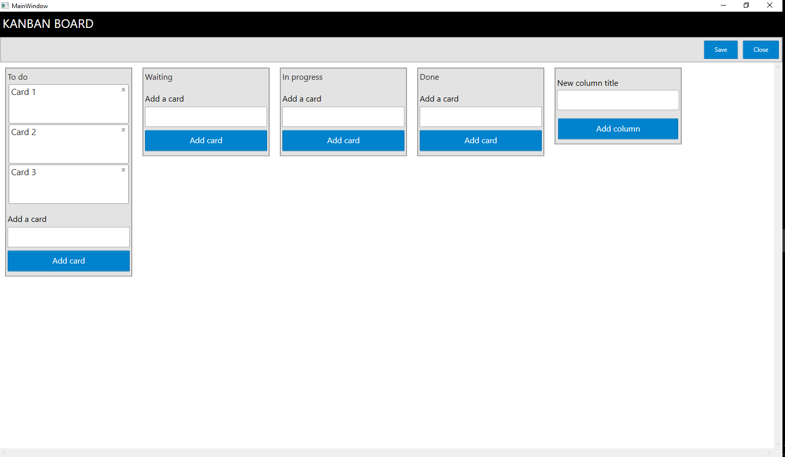

TinyKanbanBoard

To make it work you need to:

1. Clone the solution git clone https://github.com/t0x3e8/TinyKanbanBoard.git
2. Open the KanbanBoardApplication.sln with Visual Studio 2015
3. Make sure you have installed SQL Server Express or SQL Server LocalDB
4. Set startup project to KanbanApplicationMVVM
5. Build the project and run the app

Below few screenshots of the small app

